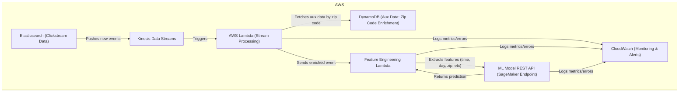

# Task 2: System Design – Real-Time Data Pipeline Architecture (Theoretical)

## Goal
Design a robust, low-latency AWS-based data pipeline that:
- Ingests clickstream data from Elasticsearch
- Processes and enriches it
- Sends model-ready features to an ML model hosted behind a REST API

---

## Architecture Diagram

---

## Technologies Used

- **Elasticsearch**: Source of clickstream data (could be replaced by a log shipper or direct integration)
- **Amazon Kinesis Data Streams**: Real-time, scalable ingestion of streaming data
- **AWS Lambda**: Serverless compute for stream processing and feature engineering
- **Amazon DynamoDB**: Fast, low-latency lookup for auxiliary data (e.g., zip code enrichment)
- **Amazon SageMaker Endpoint**: Hosts the ML model behind a REST API for real-time inference
- **Amazon CloudWatch**: Centralized logging, metrics, and alerting for monitoring and failure detection

---

## Latency < 100ms: How It’s Achieved

- **Kinesis**: Delivers events in milliseconds; supports high-throughput, low-latency streaming
- **Lambda**: Processes each event in parallel, with cold starts minimized by provisioned concurrency
- **DynamoDB**: Single-digit millisecond response times for zip code/aux data enrichment
- **Feature Engineering Lambda**: Extracts features (time of day, day of week, zip code, etc.) in-memory, avoiding I/O
- **SageMaker Endpoint**: Real-time, low-latency inference (REST API)
- **Optimizations**:
    - Use batch windowing in Kinesis for micro-batching if needed
    - Keep feature engineering logic lightweight and in-memory
    - Pre-warm Lambda and SageMaker endpoints
    - Use VPC endpoints for all AWS service calls to minimize network hops
    - Use async invocation and parallelization where possible

---

## Feature Engineering Example
- **Extracted from event**: time of day, day of week, zip code
- **Aux data**: Fetched from DynamoDB using zip code (e.g., region, demographics)
- **Combined**: All features are merged and sent to the ML model

---

## Monitoring & Failure Handling

- **CloudWatch Metrics**: Track Lambda duration, errors, Kinesis lag, SageMaker latency, DynamoDB throttling
- **CloudWatch Logs**: Capture all errors, exceptions, and custom business logic failures
- **CloudWatch Alarms**: Trigger alerts on error rates, latency spikes, or data pipeline stalls
- **DLQ (Dead Letter Queue)**: Configure Lambda with a DLQ (e.g., SQS) for failed events
- **Tracing**: Use AWS X-Ray for end-to-end tracing of requests
- **Automated Remediation**: Optionally trigger Lambda functions to retry or escalate on persistent failures

---

## Summary
This architecture leverages AWS managed services for a robust, scalable, and low-latency real-time data pipeline. It ensures sub-100ms end-to-end latency by using serverless compute, in-memory feature engineering, and fast NoSQL lookups, with comprehensive monitoring and failure handling throughout the stack. 