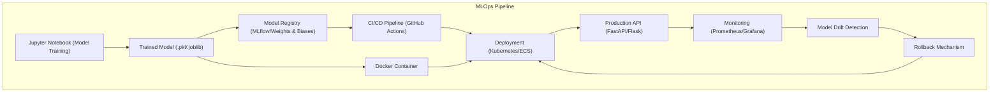

# Task 3: ML Ops + Deployment (Theoretical)

## Goal
Convert a delivery-date prediction model from Jupyter notebook to production, including:
- Production API conversion with tech stack
- Monitoring predictions and model drift
- Rollback and versioning capabilities

---

## Architecture Diagram



---

## 1. Converting Notebook to Production API

### Tech Stack
- **API Framework**: FastAPI (Python) - Fast, auto-documentation, async support
- **Containerization**: Docker - Consistent environment across dev/prod
- **Model Serialization**: Pickle/Joblib - Save trained model artifacts
- **Model Registry**: MLflow or Weights & Biases - Version control for models
- **Deployment**: Kubernetes or AWS ECS - Scalable, containerized deployment
- **Load Balancer**: AWS ALB or NGINX - Traffic distribution
- **CI/CD**: GitHub Actions or GitLab CI - Automated testing and deployment

### Conversion Process
1. **Extract Model Logic**: Convert notebook cells to modular Python functions
2. **Create API Endpoints**: Define REST endpoints for prediction requests
3. **Add Input Validation**: Validate request data using Pydantic schemas
4. **Error Handling**: Implement proper error handling and logging
5. **Dockerize**: Create Dockerfile with all dependencies
6. **Health Checks**: Add health check endpoints for monitoring

### Example API Structure
```python
# FastAPI application
from fastapi import FastAPI, HTTPException
from pydantic import BaseModel
import joblib

app = FastAPI()
model = joblib.load('delivery_prediction_model.pkl')

class PredictionRequest(BaseModel):
    day_of_year: int
    day_of_week: int
    hour_of_day: int
    zip_code: str
    # ... other features

@app.post("/predict")
async def predict_delivery(request: PredictionRequest):
    try:
        features = [request.day_of_year, request.day_of_week, 
                   request.hour_of_day, request.zip_code]
        prediction = model.predict([features])[0]
        return {"prediction": prediction, "model_version": "v1.0"}
    except Exception as e:
        raise HTTPException(status_code=500, detail=str(e))
```

---

## 2. Monitoring Predictions and Model Drift

### Monitoring Stack
- **Metrics Collection**: Prometheus - Time-series metrics storage
- **Visualization**: Grafana - Dashboard creation and alerting
- **Logging**: ELK Stack (Elasticsearch, Logstash, Kibana) - Centralized logging
- **Model Drift**: Evidently AI or custom drift detection - Statistical drift monitoring

### Key Metrics to Monitor
1. **Operational Metrics**:
   - API response time (latency)
   - Request rate (throughput)
   - Error rate and types
   - Resource utilization (CPU, memory)

2. **Model Performance Metrics**:
   - Prediction accuracy (if ground truth available)
   - Prediction distribution changes
   - Feature distribution drift
   - Model confidence scores

3. **Business Metrics**:
   - Prediction volume trends
   - User satisfaction scores
   - Business impact metrics

### Model Drift Detection
```python
# Example drift detection
import numpy as np
from scipy import stats

def detect_feature_drift(reference_data, current_data, feature_name):
    """Detect drift using Kolmogorov-Smirnov test"""
    ks_statistic, p_value = stats.ks_2samp(
        reference_data[feature_name], 
        current_data[feature_name]
    )
    return {
        'feature': feature_name,
        'ks_statistic': ks_statistic,
        'p_value': p_value,
        'drift_detected': p_value < 0.05
    }
```

### Alerting Strategy
- **Immediate Alerts**: High error rates, service downtime
- **Warning Alerts**: Model drift detected, performance degradation
- **Info Alerts**: New model deployment, scheduled retraining

---

## 3. Rollback and Versioning

### Model Versioning Strategy
1. **Semantic Versioning**: v1.0.0, v1.1.0, v2.0.0
2. **Model Registry**: Store model artifacts with metadata
3. **Git Tags**: Tag code releases with model versions
4. **Database Tracking**: Store model metadata in database

### Rollback Mechanisms
1. **Blue-Green Deployment**:
   - Deploy new model alongside existing one
   - Switch traffic gradually
   - Quick rollback by switching traffic back

2. **Canary Deployment**:
   - Deploy to small percentage of traffic first
   - Monitor performance metrics
   - Rollback if issues detected

3. **Version-Specific Endpoints**:
   ```python
   @app.post("/predict/v1")
   async def predict_v1(request: PredictionRequest):
       # Use model version 1
       pass
   
   @app.post("/predict/v2")
   async def predict_v2(request: PredictionRequest):
       # Use model version 2
       pass
   ```

### Automated Rollback Triggers
- **Performance Degradation**: If accuracy drops below threshold
- **High Error Rate**: If API errors exceed acceptable limit
- **Drift Detection**: If significant model drift is detected
- **Manual Trigger**: Emergency rollback via admin interface

### Implementation Example
```python
# Rollback configuration
ROLLBACK_CONFIG = {
    'accuracy_threshold': 0.85,
    'error_rate_threshold': 0.05,
    'drift_threshold': 0.1,
    'current_version': 'v2.0.0',
    'fallback_version': 'v1.0.0'
}

def check_rollback_conditions(metrics):
    """Check if rollback conditions are met"""
    if (metrics['accuracy'] < ROLLBACK_CONFIG['accuracy_threshold'] or
        metrics['error_rate'] > ROLLBACK_CONFIG['error_rate_threshold'] or
        metrics['drift_score'] > ROLLBACK_CONFIG['drift_threshold']):
        return True
    return False
```

---

## Deployment Pipeline

### CI/CD Workflow
1. **Code Commit**: Trigger automated testing
2. **Model Training**: Retrain model with new data
3. **Model Validation**: Test model performance
4. **Container Build**: Build Docker image
5. **Deployment**: Deploy to staging environment
6. **Testing**: Run integration tests
7. **Production Deployment**: Deploy to production
8. **Monitoring**: Monitor post-deployment metrics

### Infrastructure as Code
```yaml
# Example Kubernetes deployment
apiVersion: apps/v1
kind: Deployment
metadata:
  name: delivery-prediction-api
spec:
  replicas: 3
  selector:
    matchLabels:
      app: delivery-prediction-api
  template:
    metadata:
      labels:
        app: delivery-prediction-api
    spec:
      containers:
      - name: api
        image: delivery-prediction-api:v2.0.0
        ports:
        - containerPort: 8000
        livenessProbe:
          httpGet:
            path: /health
            port: 8000
```

---

## Summary

This MLOps strategy provides:
- **Robust Production API**: FastAPI with Docker containerization
- **Comprehensive Monitoring**: Prometheus/Grafana for operational and model metrics
- **Drift Detection**: Automated statistical drift monitoring
- **Version Control**: Model registry with semantic versioning
- **Automated Rollback**: Multiple rollback mechanisms for reliability
- **CI/CD Pipeline**: Automated testing and deployment

The system ensures high availability, maintainability, and the ability to quickly respond to model performance issues or drift detection. 